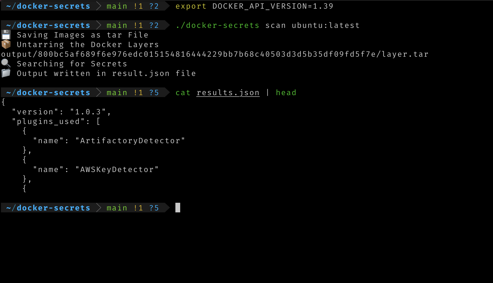

# docker-secrets
CLI based tools to find the secrets in docker Images

This tool use  [detect-secrets](https://github.com/ibm/detect-secrets) to find the secrets in the docker Image file system


### Pre-requisite

- detect-secrets Installed
- Image that need to be scanned on your local system

### Installation

- Download the binary from the release page [here](https://github.com/JOSHUAJEBARAJ/docker-secrets/releases/tag/v1.0)  and put it the path
- To build locally 

* Clone the repository
```bash 
git clone https://github.com/JOSHUAJEBARAJ/docker-secrets.git
```

Build the binary

```bash
go build .
```

### Usage

Export the Docker API Version

```
export DOCKER_API_VERSION=1.39
```

```
docker pull imagename:tag
```

```bash
docker-secrets scan <image=name>:tag
```



### Note 

By default the below command will be executed for detect-secrets.

```bash
detect-secrets scan --all-files output
```
If you want to make change to the command , You can change it [here](https://github.com/JOSHUAJEBARAJ/docker-secrets.git)
### TODO

- [ ] Ability to pull the image if it is not present in the local system
- [ ] Resolve the symlink error while extracting 

